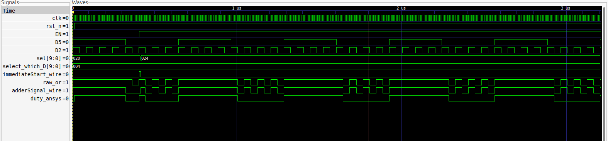
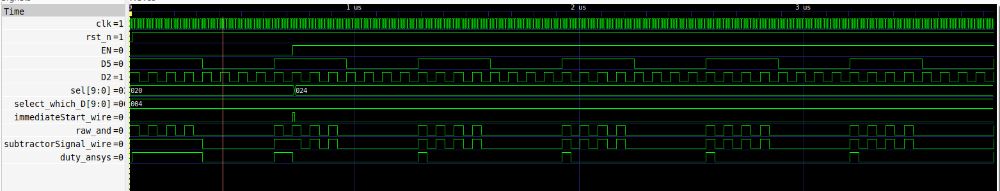
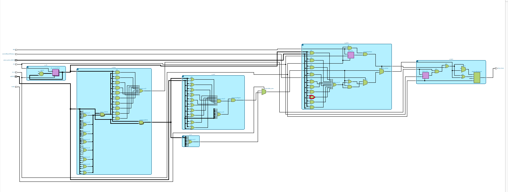

# DPWM：OR／AND duty 控制與 immediate response

使用 SystemVerilog 實作 divider、`sel` 遮罩、OR／AND gate 與 latch。EN 出現時立即調整輸出；下一個 `clk` 由外部 controller 更新 `sel`，交回 `selectDuty` 路徑。每個基頻週期只保留第一段連續 high，第一次變 low 後，latch 擋住後續小脈波。

## GTKWave 波形

### OR：增加 high 寬度



- 初始 `sel = 10'h020`，只選 D[5]。
- EN 在 D5 low、D2 high 時拉高，立即執行 OR；EN 之後保持 high。
- 下一個 `clk`，testbench 模擬 controller 將 `sel` 更新為 `10'h024`，選取 D[5] 與 D[2]。
- 下一個完整 D5 週期起，high 為 **32 + 4 = 36 clk**，low 為 **28 clk**。
- 比較 `raw_or` 與 `duty_ansys`：原始 OR 後面仍有小脈波，最終輸出會將它們擋掉。

### AND／reduce：縮短 high



- `mode = 1`、`controlRaiseOrReduce = 0`，初始只選 D[5]。
- EN 在 D5、D2 都 high 時拉高，immediate 執行 `dutyForMos & ~D2`，立即清除 high。
- 下一個 `clk`，controller 更新 `sel = 10'h024`，同步路徑改為 `D5 & D2`；latch 保持本週期已結束的狀態。
- 下一個完整週期起，第一段 high 為 **4 clk**，low 為 **60 clk**。

此處 AND 是取交集，**不是 32 − 4 = 28 clk 的算術減法**。immediate 的 AND NOT 與接手後的 AND 也是不同運算；testbench 明確測試這個行為。

## 邏輯架構



[開啟原尺寸架構圖](img/Architecture/logic_architecture.png)可查看各模組與訊號連線。

## 模組與訊號

| 模組 | 功能 |
| --- | --- |
| `tenKindOfClk` | 10-bit counter，`D = ~clk_counter`，每條 divider 先 high |
| `selectDuty` | `seleSignal = sel & D`；最高選取位元的遮罩產生基頻訊號 |
| `orGateAdder` | 對選取路徑做 OR |
| `andGateSubtractor` | 對選取路徑做 AND；未選位元填 1，空選擇輸出 0 |
| `immediate_react_pulse` | EN 當下執行 OR 或 AND NOT，下一個 clk 結束 immediate |
| `dutyLatch` | 基頻上升或 immediate 開放輸出；合成訊號變 low 後保持 low |

`mode = 0` 選 OR，`mode = 1` 選 AND。`controlRaiseOrReduce = 1` 選 immediate OR，`0` 選 immediate AND NOT。`sel` 和 `select_which_D` 均為 10-bit 遮罩，可同時選取多條 D。

最高位遮罩只用於決定 latch 的基頻週期。例如選 D5 與 D2 時，合成路徑保留兩者，但週期仍由 D5 決定。遮罩內的 `genvar` 位移是展開時的常數；此寫法是否比 mux 描述更省資源，仍需比較 Quartus 合成報告。

## 執行模擬

需要 Icarus Verilog、GTKWave；lint 另外需要 Verilator。從 repository 根目錄執行：

```bash
make test
make lint
```

或分別執行：

```bash
make test-or
make test-and
```

目前測試結果：

| Testbench | 波形檔 | 輸出檢查 | 每週期 high / low |
| --- | --- | --- | --- |
| `testbench.sv` | `wave.vcd` | 263 項通過 | 36 / 28 clk |
| `testbench_and_reduce.sv` | `wave_and_reduce.vcd` | 377 項通過 | 4 / 60 clk |

兩個 testbench 都使用 10 ns 的 `clk`，EN 只拉高一次並保持 high，驗證非同步反應、controller 接手、後續四個完整基頻週期的寬度與小脈波封鎖。

開啟已排好訊號的 GTKWave：

```bash
make wave-or
make wave-and
```

等同於先產生波形，再執行：

```bash
gtkwave wave.vcd wave_or.gtkw
gtkwave wave_and_reduce.vcd wave_and_reduce.gtkw
```

## 介面條件與驗證範圍

- controller 在 DPWM 模組外部；兩個 testbench 以 `always_ff` 模擬它在 EN 後第一個 clk 更新 `sel`。
- EN 和 `select_which_D`／控制訊號需保持到接手的 clk。再次觸發前，EN low 需先被 clk 取樣。
- `dutyLatch` 刻意使用 level-sensitive latch；RTL 模擬與 lint 已通過，尚未完成此版本的 Quartus 合成、實體毛刺與時序驗證。
- Quartus 專案目標為 Agilex 5 `A5ED013BB32AE4SCS`。模擬使用上方命令；測試平台不作為可合成設計來源。

## 檔案

- `DPWM_modu_test.sv`：RTL。
- `testbench.sv`、`testbench_and_reduce.sv`：OR 與 AND／reduce 測試。
- `wave_or.gtkw`、`wave_and_reduce.gtkw`：可攜式 GTKWave 訊號配置。
- `img/GTKwaveform/`：README 使用的 OR／AND GTKWave 截圖。
- `img/Architecture/`：邏輯架構圖。
- `DPWM_modu_test.qpf`、`DPWM_modu_test.qsf`：Quartus 專案設定。

模擬輸出、Quartus 編譯快取與備份檔不納入版本控制；VCD 可以用 `make test` 重建。
